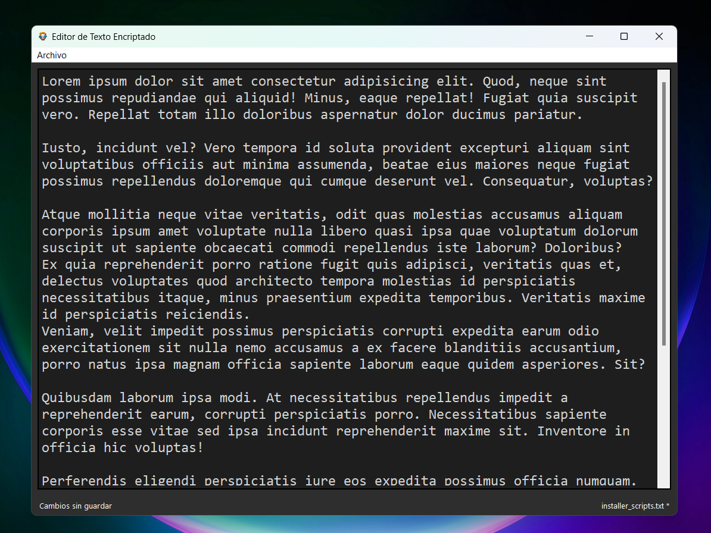

# Encrypted Text Editor

## Description
This encrypted text editor is an application I developed to allow users to create, open, save, and encrypt text files. It uses the `cryptography` library to encrypt and decrypt files, ensuring that only those with the correct password can access the content.

## Cover


## Features
- Create and edit text files.
- Save encrypted text files.
- Open encrypted text files.
- Protection against failed access attempts with temporary lockout.
- User-friendly interface with dark mode support.
- Zoom in and zoom out functionality (`ctrl +; ctrl -`).
- Undo changes with `Ctrl+Z`.

## Installation
To run this project, you need to have Python installed on your system. Additionally, you need to install the necessary libraries listed in `requirements.txt`.

### Installation Steps
1. Clone this repository:
    ```sh
    git clone https://github.com/rojas-oscar/encrypted-text-editor
    cd encrypted-text-editor
    ```

2. Create a virtual environment (optional but recommended):
    ```sh
    python -m venv venv
    source venv/bin/activate  # On Windows: venv\Scripts\activate
    ```

3. Install the dependencies:
    ```sh
    pip install -r requirements.txt
    ```

4. Run the application:
    ```sh
    python main.py
    ```

## Usage
### Create and Edit Files
- Open the application and start typing in the text area.
- To save the file, select `File > Save` or `File > Save As`.

### Save Encrypted Files
- Select `File > Save As (Encrypted)` and provide a password.

### Save Changes to Encrypted Files
- To save changes to an already opened encrypted file, press `Ctrl+S`. You will be prompted for the password; enter it to save the changes.

### Open Encrypted Files
- Select `File > Open Encrypted File` and provide the correct password to decrypt the file.

### Lockout for Failed Attempts
- If incorrect passwords are entered three consecutive times, the file will be locked for 24 hours.

### Zoom In and Zoom Out
- To zoom in on the text area, press `Ctrl+=` or `Ctrl+Numpad+`.
- To zoom out on the text area, press `Ctrl+-` or `Ctrl+Numpad-`.

### Undo Changes
- To undo a change, press `Ctrl+Z`.

## Distribution
To distribute the application as an executable, you can use `PyInstaller` to create an executable file. The `dist` folder contains the already generated executable.

### Create the Executable
If you want to create the executable yourself, follow these steps:
1. Install `PyInstaller`:
    ```sh
    pip install pyinstaller
    ```

2. Generate the executable:
    ```sh
    pyinstaller main.spec
    ```

The executable will be found in the `dist` folder.

## Requirements
- Python 3.6 or higher
- Libraries listed in `requirements.txt`

## License
This project is licensed under the MIT License. See the `LICENSE` file for more details.
